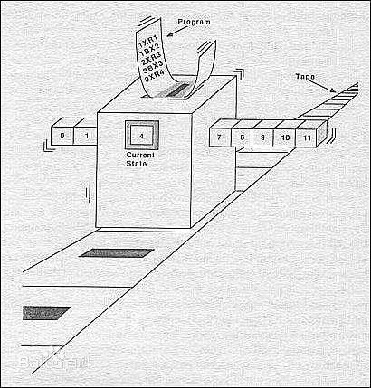
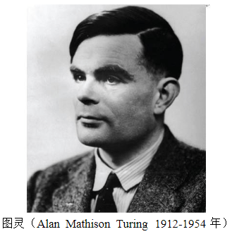

<www.tulingxueyuan.com>
## go语言提纲 ##

### 目标用户 ###

- 初学者
- 编程语言转型者

### 编程语言的演变是编程思想的体现. ###

- 过程式编程->面向对象编程->函数式编程
- 人脑需要同时思考的事物范围变小(从而可以开发更复杂的功能)

### go语言简介(从略) ###

- go语言历史,从略
- go语言核心特性(多学多用自然就懂了,现在说也没太大用处)
- 优缺点:大家来学go语言,也都多少了解一些了
- 使用go语言的项目和知名企业(从略)

### 教学方向 ###

- 学习go语言语法的同时...
- 软件工程的方面,讨论go语言的设计思路和编程范式.
- 算法的方向探讨编程.

### 一个程序示例 ###

- 图灵机

    - 由数学家艾伦(阿兰)·麦席森·图灵（1912～1954）提出的抽象计算模型
    - 可计算问题
    - 无限内存,无限运算速度
    - 如果一组操作的规则集合（如指令集、编程语言）按照一定的顺序可以计算出结果，称为图灵完备
    - 图灵不完备
    - 图灵完备的通常特征:条件跳转;改变内存数据
    - 
    
    - 备注:
        
        - 
        - 艾伦·麦席森·图灵（Alan Mathison Turing），1912年6月23日生于英国伦敦。是英国著名的数学家和逻辑学家，被称为计算机科学之父、人工智能之父，是计算机逻辑的奠基者，提出了“图灵机”和“图灵测试”等重要概念。人们为纪念其在计算机领域的卓越贡献而设立“图灵奖”;
        - 任意可计算问题都可以被解决;
        - 图灵完备的特征:条件跳转;改变内存数据;
        - 所有的通用编程语言和现代计算机的指令集都是图灵完备的;

- 编程是啥

    - 计算过程去操作一些被称为数据的抽象事物;
    - 人们创建出一些称为程序的规范模式,指导这类计算过程;
    - 怎么多快好省的开发软件,达到软件长期需求(可持续/可维护/可变化),就是软件工程的目的.

- 人类认识和表示事物的基本方式(编程也是这样的)
    
    - 对比
    - 组合
    - 抽象

- 程序设计的基本元素

    - 数据
        - 标识符(变量/函数名等)
        - 复合机制
    - 计算过程
        - 运算符
        - 基本控制结构
        - 函数
    
- 二进制

    - 信息表示的最基础单位 bit(位) ;存储单位 Byte(字节)
    - 数据类型: 数据在计算机内部都是二进制，不方便操作

- go语言程序示例

    - 编辑环境 play.golang.org (需要科学上网)
    
- 语句

    - 声明语句
    - 赋值语句
    - 控制语句
    
        - 循环语句和if语句就是典型的语句 
        
    - 表达式语句(有返回值)
    
        - 由数据和一些运算符或者函数构成
    
- 抽象话:命名(通过名字去使用计算对象和过程,组织代码)(变量/常量/函数名等)

    - 人类之所以成为人


### 安装编译环境和IDE ###

- 关于语言,不用关心:解释型语言/编译型语言(涉及技术选型) (初心)
- go语言安装< https://studygolang.com/dl >
	- go
	- go version
	- go env
- IDE安装(调试)(sublime VScode Idea goLand Eclipse LiteIDE Vi Emacs 自己喜欢的/熟悉的皆可用)
- go fmt (编码规范 / 软件工程范畴 / 团队沟通)
- 命令行编译执行 / IDE编译执行调试


### 基本语法 ###
- 变量声明与赋值
    - 一个小程序,swap函数(交换两个变量)
    
- go语言基本数据类型(不连续的,有限的)
    - 整型
        - (int / uint  / int8 / int16 / int 32 / int64)
    - 浮点型(float32 / float64 ; 离散和连续,区别有理数/实数)
        - 浮点数 vs 实数 vs 有理数
    - 复数 (complex64 / complex128   ; 离散和连续,区别数学里的复数)
    ```
    z := x + yi
    x = real(z)
    y = imag(z)
    ```
    - 布尔型 bool
    - 字符串 string
        - go语言字符串是一个不可改变的字节序列;通常被解释为采用UTF8编码的Unicode字符集
    - 扩展类型 (byte / rune / uintptr)
    
    - 大小写开头 作用域

- 常量
    - iota

- 指针
    - 指针地址和指针类型
    - 指针指向的值(获取和修改)
    - new()方法
            
- 匿名变量(放弃变量)

- 流程控制

    - 条件判断(if switch)
    - 循环(for)
    - 跳转(goto break continue)
    
- 字符和字符串
 

- 内建容器  
    - 数组
    - 切片(slice)
    - map

    - 错误处理
    
- 函数
    - 函数声明
    - 函数调用和参数传递
    - 参数可变
    - 函数变量(可作为类型)
    - 匿名函数
    - 延迟执行(defer)
    
- 变量作用域和闭包
    - 闭包携带了局部变量x，并且，从外部代码根本无法访问到变量x。换句话说，闭包就是携带状态的函数，并且它的状态可以完全对外隐藏起来。
    
    
### 基础运算符 ### 

- 在多个短变量声明和赋值中，至少有一个新声明的变量出现在左值中，即便其他变量名可能是重复声明的，编译器也不会报错。
- 布尔型无法参与数值运算，也无法与其他类型进行转换。
- 切片发生越界时，运行时会报出宕机，并打出堆栈，而原始指针只会崩溃。
- 变量、指针和地址三者的关系是：每个变量都拥有地址，指针的值就是地址。
- 变量、指针地址、指针变量、取地址、取值的相互关系和特性如下：
    - 对变量进行取地址（&）操作，可以获得这个变量的指针变量。
    - 指针变量的值是指针地址。
    - 对指针变量进行取值（*）操作，可以获得指针变量指向的原变量的值。
    - “*”操作符的根本意义就是操作指针指向的变量。当操作在右值时，就是取指向变量的值；当操作在左值时，就是将值设置给指向的变量。
- 堆分配内存和栈分配内存相比，堆适合不可预知大小的内存分配。但是为此付出的代价是分配速度较慢，而且会形成内存碎片。
    - 编译器觉得变量应该分配在堆和栈上的原则是：
    - 变量是否被取地址。
    - 变量是否发生逃逸。

<https://studygolang.com/articles/17366?fr=sidebar>

 


 

     
### 面向接口 ###
 
- 不叫做"面向对象",以示区别(java/C++) 


### 包结构 ###

  ---
  (以后展开)
  ---

- 常量 变量 选择 循环 指针 数组 容器
	- < https://research.swtch.com/godata >
 - 包和文件
 - 作用域
- 面向接口 结构体 组合的概念等
- go语法特色几处
    - 类型声明 - 放在后面 ... 优点...
    - 格式 - { } 放置位置
    - 格式 - 大小写字母区分对外开放权限
    - 格式 - :=
    - 限制功能 - 无隐式类型转换
    - 限制功能 - import不能导入没使用的包
    - 限制功能 - 不能对指针进行运算
    - 注意 - defer  何时执行，何时不会执行
    - 注意 - select 何时阻塞，何时不阻塞
    - 注意 - break，continue 后面指定标签
    - 注意 - slice 切片作为参数传递时
    - 注意 - byte  []byte,bytes包,高效使用字符串


### 函数式编程(草案,以后展开写) ###

- 闭包
- 函数特点
    -  多返回值，变长参数
    -  将函数作为参数

### 并发编程 ###

- goroutine
- 通道
- 调度

### 总结 ###

- 25个关键字

	```
	break       default     func    interface   select
	case        defer       go      map         struct
	chan        else        goto    package     switch
	const       fallthrough if      range       type
	continue    for         import  return      var
	```

	- var 和 const 语言基础里面的变量和常量申明
	- package 和 import 包管理
	- func 定义函数和方法
	- return 从函数返回
	- defer 类似析构函数
	- go 并行
	- select 选择不同类型的通讯
	- interface 定义接口
	- struct 定义抽象数据类型
	- break、case、continue、for、fallthrough、else、if、switch、goto、default 流程控制
	- chan 用于 channel 通讯
	- type 声明自定义类型
	- map 声明map类型数据
	- range 读取 slice、map、channel 数据
	


### 软件工程(草案,以后展开写) ###

- 资源管理
- 错误处理
    - 为什么要在一个集中的地方处理错误
    - 如何做

- 单元测试
- 格式规范 gofmt

### 各种示例(草案,以后展开写) ###

- 编程基本理论
    - 数据抽象
    - 数据和过程的组织方式

### 最佳实践(不断补充) ###
 < https://blog.csdn.net/shuanger_/article/details/48241767 >

- 使用单一的 GOPATH
- godep工具
- 将 for-select 封装到函数中
- 在初始化结构体时使用带有标签的语法
- 将结构体的初始化拆分到多行
- 为整数常量添加 String() 方法
- 让 iota 从 +1 开始增量
- 返回函数调用
- 把 slice、map 等定义为自定义类型
- withContext 封装函数
- 为访问 map 增加 setter，getters


### Go 语言编码规范 ###
<https://blog.csdn.net/bob_dadoudou/article/details/79476612>

- 包名:小写单词，不要使用下划线或者混合大小写
- 文件命名:简短，有意义，应该为小写单词，使用下划线分隔各个单词
- 结构体
	- 命名:采用驼峰命名法，首字母根据访问控制大写或者小写
	- struct 申明和初始化格式采用多行
- 接口命名:命名规则基本和上面的结构体类型,单个函数的结构名以 “er” 作为后缀，例如 Reader , Writer 
- 变量命名:
	- 和结构体类似，变量名称一般遵循驼峰法
	- 如果变量为私有，且特有名词为首个单词，则使用小写，如 apiClient
	- 其它情况都应当使用该名词原有的写法，如 APIClient、repoID、UserID
	- 错误示例：UrlArray，应该写成 urlArray 或者 URLArray
- 若变量类型为 bool 类型，则名称应以 Has, Is, Can 或 Allow 开头
- 常量命名:全部大写字母组成，并使用下划线分词;枚举类型的常量，需要先创建相应类型
- 注释
	- 包注释
		```
		// util 包， 该包包含了项目共用的一些常量，封装了项目中一些共用函数。
		// 创建人： barryqiu
		// 创建时间： 20171125
		```
	- 结构（接口）注释: 结构体名， 结构体说明。同时结构体内的每个成员变量都要有说明，该说明放在成员变量的后面（注意对齐），实例如下
		```
		// User ， 用户对象，定义了用户的基础信息
		type User struct{
		    Username  string // 用户名
		    Email     string // 邮箱
		}
		```
	- 函数（方法）注释
		- 简要说明，格式说明：以函数名开头，“，”分隔说明部分
		- 参数列表：每行一个参数，参数名开头，“，”分隔说明部分
		- 返回值： 每行一个返回值
		```
		// NewtAttrModel ， 属性数据层操作类的工厂方法
		// 参数：
		//      ctx ： 上下文信息
		// 返回值：
		//      属性操作类指针
		func NewAttrModel(ctx *common.Context) *AttrModel {
		}
		```

	- 代码逻辑注释:关键位置的代码逻辑,方便其他开发者阅读该段代码
	- 注释风格
		- 统一使用中文注释，对于中英文字符之间严格使用空格分隔
		- 全部使用单行注释，禁止使用多行注释
		- 和代码的规范一样，单行注释不要过长，禁止超过 120 字符

- 代码风格
	- 缩进和折行
		- 缩进直接使用 gofmt 工具格式化即可
		- 折行方面，一行最长不超过120个字符
	- 括号和空格:直接使用 gofmt 工具格式化
	- import 规范:如果你的包引入了三种类型的包，标准库包，程序内部包，第三方包，每种之间用空行分隔;在项目中不要使用相对路径引入包
	- 错误处理
		- 不能丢弃任何有返回err的调用，不要使用 _ 丢弃，必须全部处理
		- 尽早return：一旦有错误发生，马上返回
		- 尽量不要使用panic，除非你知道你在做什么
		- 错误描述如果是英文必须为小写，不需要标点结尾
		- 采用独立的错误流进行处理
	- 测试
		- 单元测试文件名命名规范为 example_test.go
		- 测试用例的函数名称必须以 Test 开头，例如：TestExample
		- 每个重要的函数都要首先编写测试用例，测试用例和正规代码一起提交方便进行回归测试

- 常用工具
	- gofmt
	- goimport
	- go vet


